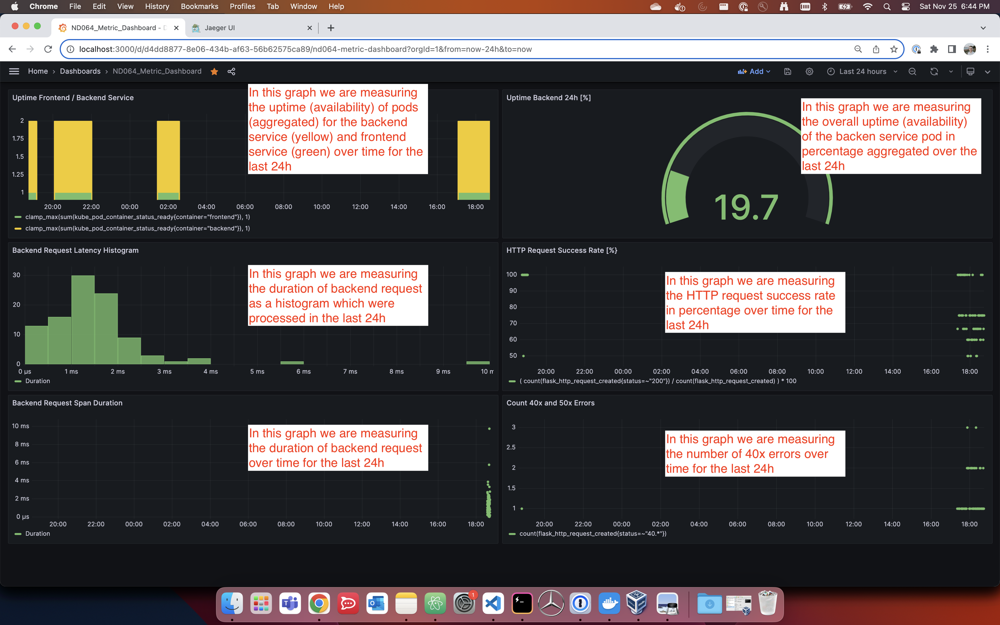

**Note:** For the screenshots, you can store all of your answer images in the `answer-img` directory.

## Verify the monitoring installation

*TODO:* run `kubectl` command to show the running pods and services for all components. Take a screenshot of the output and include it here to verify the installation -> Done

## Setup the Jaeger and Prometheus source
*TODO:* Expose Grafana to the internet and then setup Prometheus as a data source. Provide a screenshot of the home page after logging into Grafana. -> Done

## Create a Basic Dashboard
*TODO:* Create a dashboard in Grafana that shows Prometheus as a source. Take a screenshot and include it here.

## Describe SLO/SLI
*TODO:* Describe, in your own words, what the SLIs are, based on an SLO of *monthly uptime* and *request response time*.

SLIs are metrics or measurements used to assess the performance and reliability of a service. 
The SLI for monthly uptime would measure the percentage of the time a service is operational within a given month. E.g. 99.5%
The SLI for request response time (e.g. in milliseconds) would measure the time it takes to respond to incoming requests. As it may not alwasy take the same amout of time to respond, a median value (e.g. 250ms) or time distribution histogram would be useful to indicate the performance. 

## Creating SLI metrics.
*TODO:* It is important to know why we want to measure certain metrics for our customer. Describe in detail 5 metrics to measure these SLIs. 

- Monthly Uptime: Measures the availablity of a system. Ensuring high uptime helps build trust with customers, as they can rely on the service to be available when they need it
- Average/Median reqeust response time. Measures how quickly the service responds to user requests. Fast response times enhance the user experience, leading to higher user satisfaction
- Peak Hours Average/Median request response time. Measures how quickly the service responds to user requests during peak hours. This is to ensure the system scales or is robust enough to handle multiple customer requests at the same time. 
- Error rate: Tracks the percentage of requests or transactions that result in errors. High error rates can indicate underlying issues or bugs that need to be addressed promptly
- Latency: Measures the time it takes for data to travel from the source to the destination. In real-time applications like video conferencing, low latency is crucial for smooth user interactions
 

## Create a Dashboard to measure our SLIs
*TODO:* Create a dashboard to measure the uptime of the frontend and backend services We will also want to measure to measure 40x and 50x errors. Create a dashboard that show these values over a 24 hour period and take a screenshot.

## Tracing our Flask App
*TODO:*  We will create a Jaeger span to measure the processes on the backend. Once you fill in the span, provide a screenshot of it here. Also provide a (screenshot) sample Python file containing a trace and span code used to perform Jaeger traces on the backend service.

## Jaeger in Dashboards
*TODO:* Now that the trace is running, let's add the metric to our current Grafana dashboard. Once this is completed, provide a screenshot of it here.

## Report Error
*TODO:* Using the template below, write a trouble ticket for the developers, to explain the errors that you are seeing (400, 500, latency) and to let them know the file that is causing the issue also include a screenshot of the tracer span to demonstrate how we can user a tracer to locate errors easily.

TROUBLE TICKET

Name: Immanuel Baur

Date: 25th of November, 2023

Subject: High latency in API call detected

Affected Area: backend API request (/test)

Severity: high

Description: Looking at the Jaeger traces, a latency of 1 second is detected when calling the /test API of the backend service. File can be found at Project_Starter_Files-Building_a_Metrics_Dashboard/reference-app/backend/app.py

## Creating SLIs and SLOs
*TODO:* We want to create an SLO guaranteeing that our application has a 99.95% uptime per month. Name four SLIs that you would use to measure the success of this SLO
Availability SLI: e.g. 90%. A high availability SLI indicates that the service is reliably responding to requests
Error Rate SLI: e.g. 10%. A low error rate SLI indicates that the service is handling requests without significant errors
Latency SLI: e.g. 95% below 200ms. Low latency SLI values indicate that the service responds quickly to requests
Uptime SLI: e.g. 99%. A high uptime SLI indicates that the service is consistently available

## Building KPIs for our plan
*TODO*: Now that we have our SLIs and SLOs, create a list of 2-3 KPIs to accurately measure these metrics as well as a description of why those KPIs were chosen. We will make a dashboard for this, but first write them down here.

Error Rate KPI: This KPI measures the rate of errors in your service, aligning with the Error Rate SLI. It calculates the percentage of requests that result in errors

Latency KPI: This KPI measures the average response time of your service, aligning with the Latency SLI. It calculates the average latency of requests within a specified time threshold, can be displayed via histogram. 

Uptime KPI: This KPI measures the overall uptime of your service, aligning with the Uptime SLI. It calculates the percentage of time the service is available in a given period (e.g., a day)

## Final Dashboard
*TODO*: Create a Dashboard containing graphs that capture all the metrics of your KPIs and adequately representing your SLIs and SLOs. Include a screenshot of the dashboard here, and write a text description of what graphs are represented in the dashboard.  

## Setup:

### Install Helm
sudo zypper in git
curl https://raw.githubusercontent.com/helm/helm/main/scripts/get-helm-3 | bash

### Install Grafana and Prometheus 
kubectl create namespace monitoring
helm repo add prometheus-community https://prometheus-community.github.io/helm-charts
### helm repo add stable https://kubernetes-charts.storage.googleapis.com # this is deprecated
helm repo add stable https://charts.helm.sh/stable
helm repo update
helm install prometheus prometheus-community/kube-prometheus-stack --namespace monitoring --kubeconfig /etc/rancher/k3s/k3s.yaml

### Install Jaeger
`
kubectl create namespace observability
`
### Please use the latest stable version
`export jaeger_version=v1.28.0 
kubectl create -f https://raw.githubusercontent.com/jaegertracing/jaeger-operator/${jaeger_version}/deploy/crds/jaegertracing.io_jaegers_crd.yaml
kubectl create -n observability -f https://raw.githubusercontent.com/jaegertracing/jaeger-operator/${jaeger_version}/deploy/service_account.yaml
kubectl create -n observability -f https://raw.githubusercontent.com/jaegertracing/jaeger-operator/${jaeger_version}/deploy/role.yaml
kubectl create -n observability -f https://raw.githubusercontent.com/jaegertracing/jaeger-operator/${jaeger_version}/deploy/role_binding.yaml
kubectl create -n observability -f https://raw.githubusercontent.com/jaegertracing/jaeger-operator/${jaeger_version}/deploy/operator.yaml
`
### Create “all-in-one” Jaeger instance
`kubectl apply -f manifests/other/jaeger-instance.yaml`

### Grant Cluster wide Permissions to Jaeger
`
kubectl create -f https://raw.githubusercontent.com/jaegertracing/jaeger-operator/${jaeger_version}/deploy/cluster_role.yaml
kubectl create -f https://raw.githubusercontent.com/jaegertracing/jaeger-operator/${jaeger_version}/deploy/cluster_role_binding.yaml
`
### Port Forwarding
`
kubectl port-forward svc/frontend --address 0.0.0.0 8080:8080
kubectl port-forward svc/prometheus-grafana --address 0.0.0.0 3000:80 -n monitoring
kubectl port-forward service/my-jaeger-query --address 0.0.0.0 16686:16686 -n observability
`

## Notes
`
update requirements to latest available package version
build app container images and push them to personal docker hub
``
docker build -t immbaur/nd064-trial:latest reference-app/trial/
``
test container locally 
docker run -p 8082:8080 immbaur/nd064-trial:latest
``
push container 
docker push immbaur/nd064-trial:latest
`

Update the deployment configurations to pull personal images 
* and to use jaeger sidecar injections
* service monitor, since apps and jaeger are on different namespaces

Add jaeger Grafana data soure, url: my-jaeger-query.observability.svc.cluster.local:16686

Helpful commands, e.g. for trial service

`show metrics 
curl localhost:8082/metrics
``
curl localhost:8082/
curl localhost:8082/trace
curl localhost:8082/test
``
kubectl logs -f -l app=trial --max-log-requests 20
`